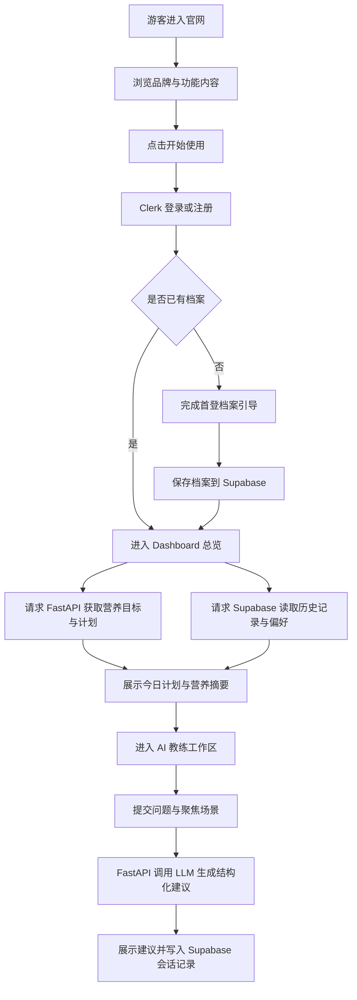

## 1. 产品概述
EatFit 官方站点是品牌官网与登录后营养管理工作台的一体化 Web 产品，面向关注体重管理、健康饮食和 AI 饮食建议的个人用户。
- 官网负责品牌表达、功能展示和转化注册；Dashboard 负责用户资料管理、每日饮食计划、食谱浏览、买菜清单和 AI 营养教练交互。
- 产品目标是在桌面端提供一套足够专业、可信、可转化的官方站体验，并与现有 FastAPI 营养计算和 LLM 教练能力打通。

## 2. 核心功能

### 2.1 用户角色
| 角色 | 注册方式 | 核心权限 |
|------|----------|----------|
| 游客 | 无需注册 | 浏览官网内容、查看功能亮点、进入注册/登录 |
| 登录用户 | Clerk 邮箱/社交登录 | 访问个人 Dashboard、维护档案、查看计划、获取 AI 饮食建议 |

### 2.2 功能模块
1. **官网 Landing Page**：品牌首屏、产品价值、功能展示、真实场景介绍、FAQ、行动转化。
2. **认证入口**：Clerk 登录、注册、登录态守卫、首登引导。
3. **Dashboard 总览**：今日目标、营养进度、计划摘要、提醒卡片、最近 AI 建议。
4. **营养档案管理**：基础身体数据、目标、活动水平、饮食偏好、过敏原、忌口维护。
5. **每日饮食计划**：每日目标、餐次安排、热量与三大营养素汇总、计划刷新。
6. **食谱与买菜清单**：食谱库浏览、按餐次和标签筛选、清单聚合展示。
7. **AI 营养教练**：围绕每日复盘、餐次策略、外食、嘴馋控制四种场景获取结构化建议。

### 2.3 页面详情
| 页面名称 | 模块名称 | 功能说明 |
|-----------|-----------|-----------|
| 官网 `/` | 顶部导航 | 品牌标识、产品导航、登录、开始使用按钮，滚动时转为半透明悬浮状态 |
| 官网 `/` | 首屏 Hero | 高辨识度视觉、核心价值主张、产品预览卡、CTA、动态数字指标 |
| 官网 `/` | 功能亮点区 | 展示 AI 教练、个性化计划、营养追踪、买菜清单等能力 |
| 官网 `/` | 产品工作流区 | 用分步骤方式解释从注册到获得建议的完整链路 |
| 官网 `/` | 社会证明与 FAQ | 强化可信度，降低首次注册阻力 |
| 登录/注册 | Clerk 认证容器 | 承载 Clerk 预构建组件，品牌化包装，登录成功后跳转 `/app` |
| Dashboard `/app` | 总览头部 | 欢迎语、日期、今日状态、快捷操作 |
| Dashboard `/app` | 今日营养卡 | 显示目标热量、蛋白质、碳水、脂肪及完成度 |
| Dashboard `/app` | 每日计划摘要 | 以早餐/午餐/晚餐/加餐形式展示推荐餐次 |
| Dashboard `/app` | AI 建议卡 | 展示最近一次建议摘要、评分、下一步动作 |
| Dashboard `/app/profile` | 档案表单 | 维护年龄、身高、体重、体脂、目标、活动水平、过敏原等 |
| Dashboard `/app/plan` | 计划面板 | 查看某日饮食计划、切换日期、重新生成、查看营养汇总 |
| Dashboard `/app/recipes` | 食谱库 | 按餐次、标签筛选，查看菜谱详情、烹饪时间和营养信息 |
| Dashboard `/app/grocery` | 买菜清单 | 基于计划聚合食材，按类别分组，支持打印和勾选 |
| Dashboard `/app/coach` | AI 教练工作区 | 选择场景、输入上下文、获取结构化建议并展示风险提醒与行动项 |

## 3. 核心流程
游客访问官网后，通过内容理解 EatFit 的价值并完成注册。登录后系统检查是否已有营养档案；若没有则进入首登引导并写入 Supabase。档案完成后，Dashboard 调用 FastAPI 获取营养目标、饮食计划、买菜清单和 AI 建议，并将关键用户数据和计划快照保存在 Supabase 中，供后续会话和多端访问使用。

## 4. 用户界面设计
### 4.1 设计风格
- 整体风格：深色、精致、偏编辑感的健康科技品牌，强调“专业可信 + 高级质感”。
- 主色：墨黑、冷白、草本荧光绿；辅色使用少量铜金与石板灰，制造层次。
- 按钮风格：大圆角、轻微玻璃质感、带微弱内发光和悬浮位移动效。
- 字体建议：标题使用具识别度的衬线展示字体，正文使用现代无衬线字体，形成品牌反差。
- 布局风格：桌面优先，官网采用大留白与非对称分栏；Dashboard 采用高密度信息卡片和固定侧边导航。
- 图标风格：线性图标配合少量高光数据徽标，不使用卡通化元素。

### 4.2 页面设计概览
| 页面名称 | 模块名称 | UI 元素 |
|-----------|-----------|-----------|
| 官网 `/` | 首屏 Hero | 大字号标题、产品预览面板、渐变光晕背景、数据浮层、分层入场动画 |
| 官网 `/` | 功能亮点区 | 交错排版、编号模块、细线装饰、局部高亮词 |
| 官网 `/` | 工作流区 | 时间轴式步骤卡、连线动效、图标与解释文案结合 |
| 官网 `/` | CTA 结尾区 | 强对比背景、简洁表单入口、重复品牌主张 |
| 登录/注册 | 认证容器 | 居中品牌卡片、柔和背景纹理、Clerk 组件主题化 |
| Dashboard `/app` | 总览页 | 多列统计卡片、营养进度环、计划列表、建议摘要卡 |
| Dashboard `/app/profile` | 档案页 | 表单分组卡片、滑杆与标签输入、保存状态反馈 |
| Dashboard `/app/plan` | 计划页 | 日期切换、餐次卡片、宏量营养汇总栏、刷新按钮 |
| Dashboard `/app/recipes` | 食谱页 | 筛选条、瀑布式卡片、营养标签、详情侧滑层或详情页 |
| Dashboard `/app/grocery` | 清单页 | 分组列表、可勾选清单、打印视图优化 |
| Dashboard `/app/coach` | 教练页 | 左侧场景选择、右侧建议输出、评分徽章、风险提示和行动清单 |

### 4.3 响应式策略
- 默认采用桌面优先设计，针对笔记本和大屏显示器优化首屏比例、卡片栅格和可视密度。
- 平板端保留完整功能，导航由顶部切换为可收起侧边栏。
- 手机端保留官网浏览和核心 Dashboard 使用能力，弱化复杂图表，优先展示卡片流。
- 所有交互区域满足键盘可达和基础无障碍对比度要求。
