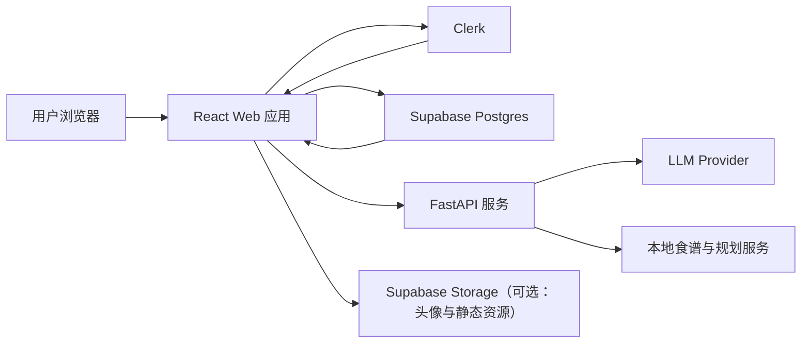
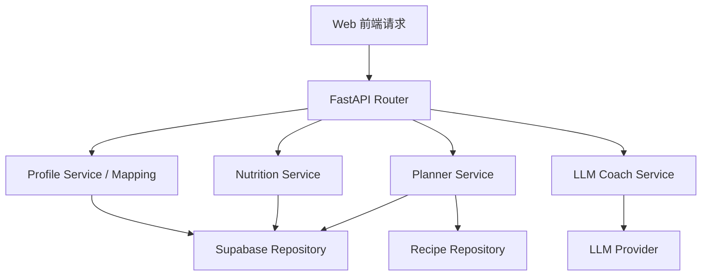
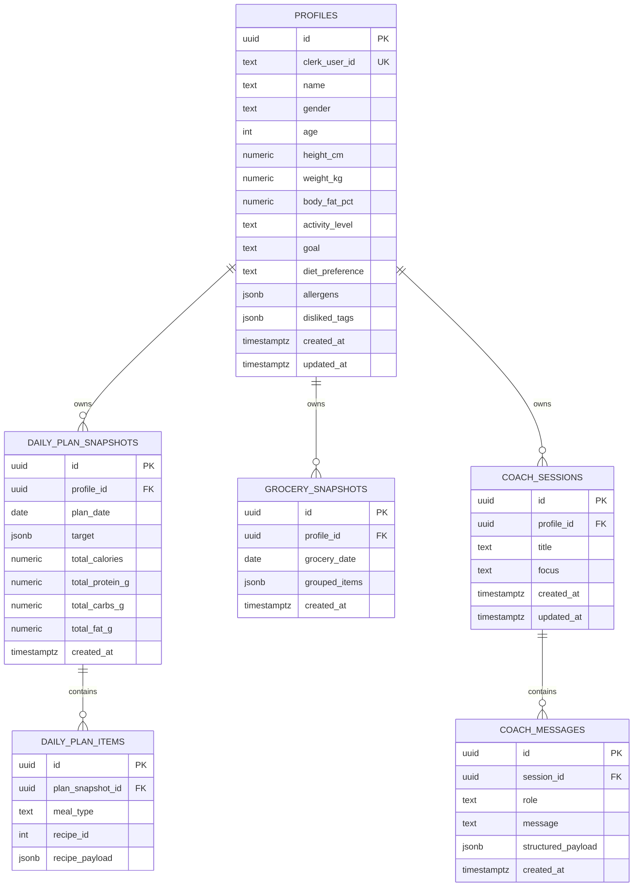

## 1. 架构设计
官方站点采用单一 React Web 应用承载营销官网与登录后产品区。认证由 Clerk 负责，业务数据存储在 Supabase，现有 FastAPI 后端继续承担营养计算、食谱规划和 LLM 教练编排职责。



## 2. 技术说明
- 前端：React@18 + TypeScript + Vite + Tailwind CSS@3 + React Router@6
- 状态与数据层：TanStack Query + React Hook Form + Zod
- 认证：Clerk（`@clerk/clerk-react`），使用受保护路由和登录态同步
- 数据库：Supabase Postgres + Row Level Security
- 后端：现有 FastAPI，新增 Web 端鉴权与用户映射接口
- 外部服务：Volcengine Ark / MiniMax M3 用于 AI 营养教练
- 初始化工具：Vite

## 3. 路由定义
| 路由 | 作用 |
|------|------|
| `/` | 官方 Landing Page，展示品牌、产品能力、FAQ 与注册入口 |
| `/sign-in/*` | Clerk 登录页 |
| `/sign-up/*` | Clerk 注册页 |
| `/app` | Dashboard 总览，展示今日营养、计划摘要、快捷入口 |
| `/app/profile` | 用户营养档案维护 |
| `/app/plan` | 每日饮食计划与宏量营养汇总 |
| `/app/recipes` | 食谱库与筛选浏览 |
| `/app/grocery` | 买菜清单与分组列表 |
| `/app/coach` | AI 营养教练工作区 |

## 4. API 定义
Web 端优先通过 Supabase 读写用户持久化数据，通过 FastAPI 获取计算类与 AI 类结果。

### 4.1 前端领域模型

```ts
export type Goal = "lose_fat" | "maintain" | "gain_muscle";
export type ActivityLevel =
  | "sedentary"
  | "light"
  | "moderate"
  | "active"
  | "very_active";
export type CoachFocus =
  | "daily_review"
  | "meal_strategy"
  | "eating_out"
  | "cravings";

export interface UserProfile {
  id: string;
  clerkUserId: string;
  name: string;
  gender: "male" | "female";
  age: number;
  heightCm: number;
  weightKg: number;
  bodyFatPct?: number | null;
  activityLevel: ActivityLevel;
  goal: Goal;
  allergens: string[];
  dislikedTags: string[];
  dietPreference?: string | null;
  createdAt: string;
  updatedAt: string;
}

export interface NutritionTarget {
  bmr: number;
  tdee: number;
  targetCalories: number;
  proteinG: number;
  carbsG: number;
  fatG: number;
  explanation: string;
}

export interface CoachRequest {
  focus: CoachFocus;
  message?: string;
}

export interface CoachResponse {
  focus: CoachFocus;
  headline: string;
  summary: string;
  score: number;
  riskAlerts: string[];
  nutritionInsights: string[];
  nextActions: string[];
  mealStrategy: string[];
  disclaimer: string;
}
```

### 4.2 Supabase 访问约定
1. `profiles`：按 `clerk_user_id` 读取和更新用户档案。
2. `daily_plan_snapshots`：缓存某日计划结果，减少重复计算。
3. `grocery_snapshots`：保存某日买菜清单。
4. `coach_sessions` 与 `coach_messages`：保存 AI 教练会话与消息记录。

### 4.3 FastAPI 接口约定
沿用现有接口，并在实现阶段补充基于 Clerk 用户的映射能力。

| 方法 | 路径 | 说明 |
|------|------|------|
| `POST` | `/api/profiles` | 创建营养档案 |
| `GET` | `/api/profiles/{profile_id}` | 获取档案 |
| `PUT` | `/api/profiles/{profile_id}` | 更新档案 |
| `GET` | `/api/profiles/{profile_id}/target` | 获取营养目标 |
| `GET` | `/api/recipes` | 获取食谱列表 |
| `GET` | `/api/recipes/{recipe_id}` | 获取食谱详情 |
| `GET` | `/api/plan/{profile_id}` | 获取某日计划 |
| `GET` | `/api/plan/{profile_id}/grocery` | 获取某日买菜清单 |
| `POST` | `/api/coach/{profile_id}/advice` | 获取 AI 饮食建议 |

## 5. 服务端架构图


## 6. 数据模型
### 6.1 数据模型定义


### 6.2 数据定义语言
```sql
create extension if not exists "pgcrypto";

create table if not exists public.profiles (
  id uuid primary key default gen_random_uuid(),
  clerk_user_id text not null unique,
  name text not null,
  gender text not null check (gender in ('male', 'female')),
  age integer not null check (age between 10 and 100),
  height_cm numeric(5,2) not null check (height_cm between 100 and 250),
  weight_kg numeric(5,2) not null check (weight_kg between 30 and 250),
  body_fat_pct numeric(5,2),
  activity_level text not null check (activity_level in ('sedentary', 'light', 'moderate', 'active', 'very_active')),
  goal text not null check (goal in ('lose_fat', 'maintain', 'gain_muscle')),
  diet_preference text,
  allergens jsonb not null default '[]'::jsonb,
  disliked_tags jsonb not null default '[]'::jsonb,
  created_at timestamptz not null default now(),
  updated_at timestamptz not null default now()
);

create table if not exists public.daily_plan_snapshots (
  id uuid primary key default gen_random_uuid(),
  profile_id uuid not null references public.profiles(id) on delete cascade,
  plan_date date not null,
  target jsonb not null,
  total_calories numeric(8,2) not null,
  total_protein_g numeric(8,2) not null,
  total_carbs_g numeric(8,2) not null,
  total_fat_g numeric(8,2) not null,
  created_at timestamptz not null default now(),
  unique (profile_id, plan_date)
);

create table if not exists public.daily_plan_items (
  id uuid primary key default gen_random_uuid(),
  plan_snapshot_id uuid not null references public.daily_plan_snapshots(id) on delete cascade,
  meal_type text not null check (meal_type in ('breakfast', 'lunch', 'dinner', 'snack')),
  recipe_id integer not null,
  recipe_payload jsonb not null
);

create table if not exists public.grocery_snapshots (
  id uuid primary key default gen_random_uuid(),
  profile_id uuid not null references public.profiles(id) on delete cascade,
  grocery_date date not null,
  grouped_items jsonb not null,
  created_at timestamptz not null default now(),
  unique (profile_id, grocery_date)
);

create table if not exists public.coach_sessions (
  id uuid primary key default gen_random_uuid(),
  profile_id uuid not null references public.profiles(id) on delete cascade,
  title text not null,
  focus text not null check (focus in ('daily_review', 'meal_strategy', 'eating_out', 'cravings')),
  created_at timestamptz not null default now(),
  updated_at timestamptz not null default now()
);

create table if not exists public.coach_messages (
  id uuid primary key default gen_random_uuid(),
  session_id uuid not null references public.coach_sessions(id) on delete cascade,
  role text not null check (role in ('user', 'assistant')),
  message text not null,
  structured_payload jsonb,
  created_at timestamptz not null default now()
);

create index if not exists idx_profiles_clerk_user_id
  on public.profiles(clerk_user_id);

create index if not exists idx_daily_plan_snapshots_profile_date
  on public.daily_plan_snapshots(profile_id, plan_date desc);

create index if not exists idx_grocery_snapshots_profile_date
  on public.grocery_snapshots(profile_id, grocery_date desc);

create index if not exists idx_coach_sessions_profile_updated
  on public.coach_sessions(profile_id, updated_at desc);

alter table public.profiles enable row level security;
alter table public.daily_plan_snapshots enable row level security;
alter table public.daily_plan_items enable row level security;
alter table public.grocery_snapshots enable row level security;
alter table public.coach_sessions enable row level security;
alter table public.coach_messages enable row level security;
```

## 7. 鉴权与集成决策
1. Clerk 负责前端登录、用户管理和会话状态。
2. Supabase 负责持久化业务数据，不直接作为主认证入口。
3. 实现阶段为 Clerk 配置可供 Supabase 验证的 JWT 模板，用于 RLS 场景下的用户隔离。
4. FastAPI 增加 Web 端用户映射逻辑：前端传递 Clerk 身份，后端将其映射到 `profiles` 记录或创建档案。
5. 官网静态内容和 Dashboard 在同一代码库维护，共享设计系统、鉴权上下文和 API 客户端。
